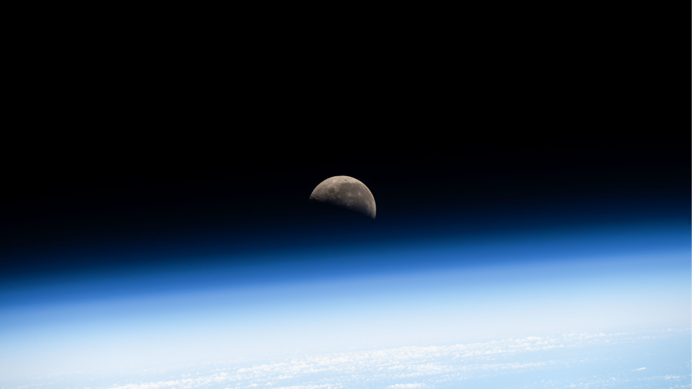

<!-- ========================================= -->
<!--                 BANNER                   -->
<!-- ========================================= -->

  

<h1 align="center">Hi, I'm Neewin 👋</h1>

<h3 align="center">
MCA Student • Physics Graduate • AI Enthusiast • Software Developer
</h3>

Building intelligent software with curiosity inspired by both technology and the universe.

---

## 👨‍💻 About Me

<table>
<tr>
<td>

- 🎓 Pursuing a **Master of Computer Applications (MCA)**
- ⚛️ Physics graduate with a strong interest in computing and scientific exploration
- 🤖 Passionate about **Artificial Intelligence**, **Machine Learning**, and **Natural Language Processing**
- 💻 Enjoy building software that solves real-world problems through clean and efficient design
- 🌱 Currently learning **Large Language Models (LLMs)**, **IBM watsonx.ai**, **Android Development**, and **Cloud Technologies**
- 🌌 Fascinated by **astronomy, astrophysics, and space exploration**
- 🔭 Enjoy stargazing whenever the skies are clear
- 🐈 Cat enthusiast and lifelong learner

</td>
</tr>
</table>

---

## 🛠️ Tech Stack

---

## 🚀 Featured Projects

### 🌾 Automated Crop Disease Symptom Extraction

Research-oriented project leveraging **Named Entity Recognition (NER)** to automatically extract crop disease symptoms from unstructured farmer chat logs.

### 🥗 AI Nutrition Agent

AI-powered nutrition assistant built using **Flask** and **IBM watsonx.ai**.

### 📱 Android Applications

Collection of Android applications developed while exploring native Android development.

---

## 📚 Currently Learning

---

## 📊 GitHub Analytics

---

## 🌌 Beyond Code

🔭 Stargazing • 🌠 Astronomy • ⚛️ Physics • 🧩 Problem Solving • 🌍 Open Source • 🐈 Cats

---

## 🤝 Connect With Me

---

<i>"Guided by curiosity—from understanding the laws of the universe to building intelligent systems that shape the future."</i> 🚀

